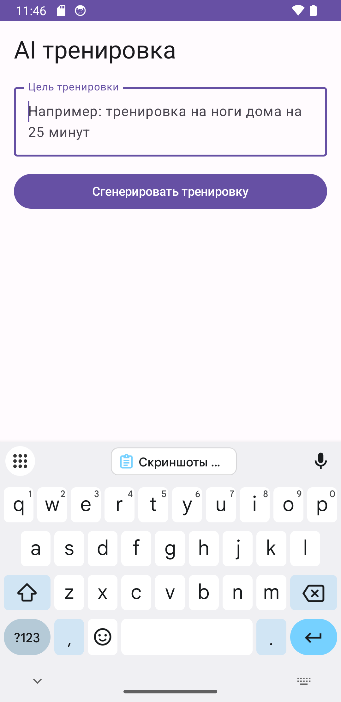
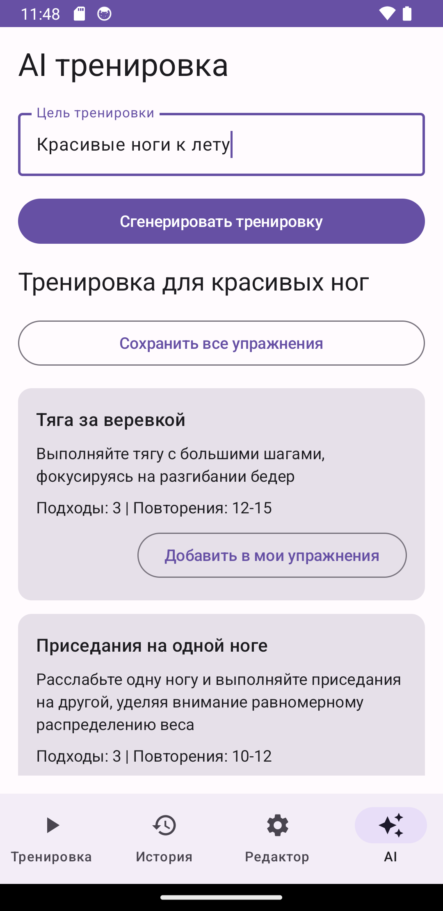
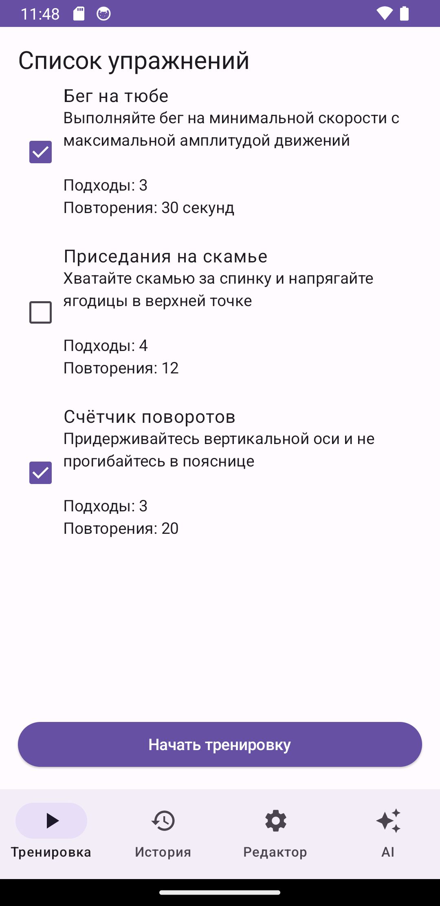
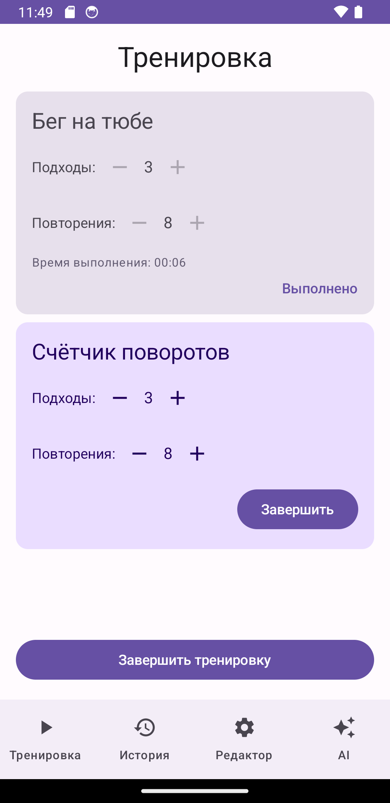
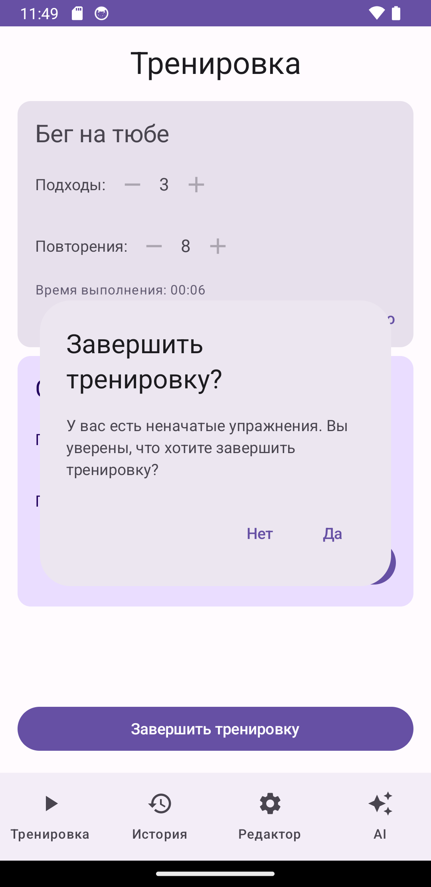
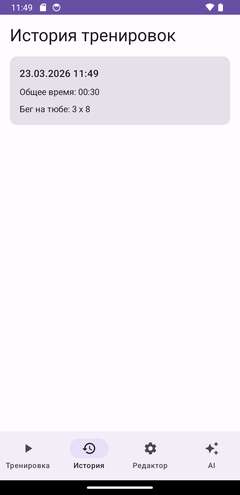
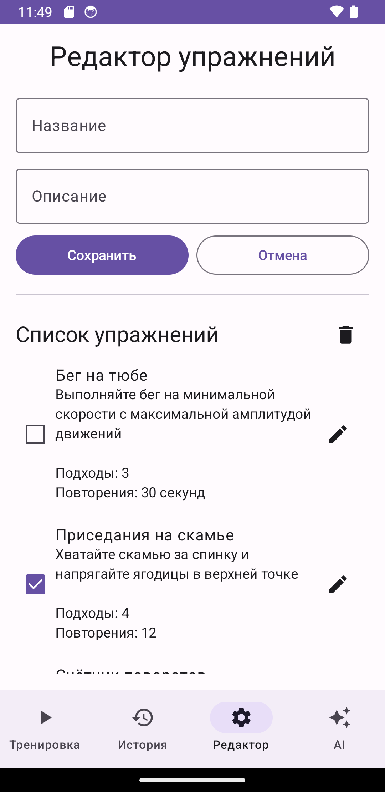
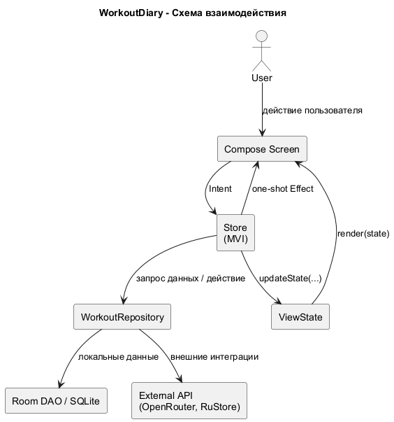
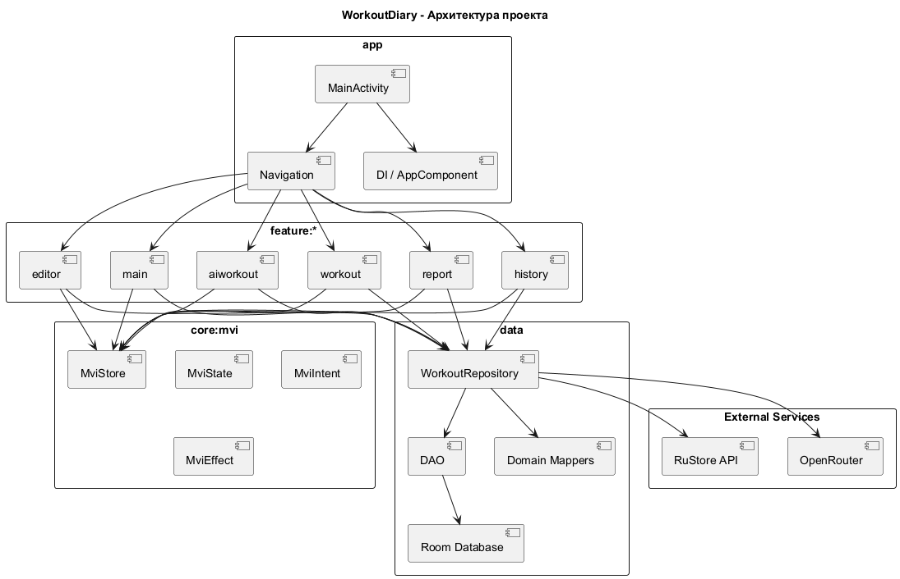
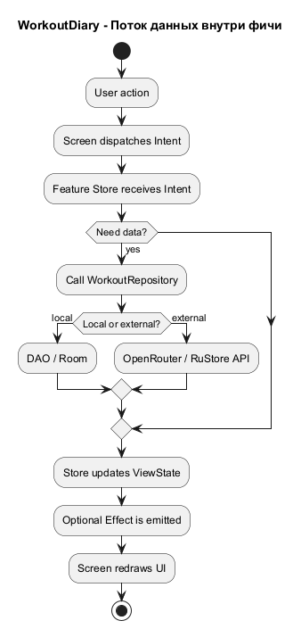

# WorkoutDiary

Android-приложение для ведения дневника тренировок.

## Описание проекта

Приложение позволяет:

- добавлять и удалять упражнения;
- выбирать упражнения перед началом тренировки;
- проводить тренировку с указанием количества подходов и повторений;
- отслеживать время выполнения каждого упражнения;
- сохранять тренировки в локальную базу данных;
- просматривать историю тренировок с датой, списком упражнений и общим временем;
- генерировать тренировку через AI и сохранять предложенные упражнения в локальную базу.

## Release Notes

### Версия 1.0

- `versionName`: `1.0`
- `versionCode`: `1`

- добавлены экран тренировки и сохранение истории занятий;
- добавлена AI-генерация тренировок через OpenRouter;
- настроена публикация в RuStore через Gradle task `publishToRuStore`;
- добавлена release-подпись сборки через параметры из `local.properties`.

### Версия 1.1

- `versionName`: `1.1`
- `versionCode`: `11`
- Добавлена фича "Формирование отчета за заданный период"

### Шаблон для следующей версии

### Версия X.Y

- `versionName`: `X.Y`
- `versionCode`: `N`
- описание изменений...

## Скриншоты

<p align="center">
  
  
  
</p>

<p align="center">
  
  
  
</p>

<p align="center">
  
  
</p>

## Технологии

- Kotlin
- Jetpack Compose
- Room
- MVI
- OpenRouter API

## Архитектура

Проект построен как многомодульное Android-приложение с feature-first структурой и MVI-подходом для presentation слоя.

Основные принципы:

- `app` отвечает за DI, навигацию и связывание feature-модулей;
- каждая фича вынесена в отдельные модули `api` и `impl`;
- состояние экрана хранится в `Store` (`MviStore`), UI только отображает `State` и отправляет `Intent`;
- доступ к данным идет через `WorkoutRepository`;
- локальное хранение реализовано через `Room` (`DAO -> repository -> domain models`);
- внешняя AI-интеграция вынесена в отдельную feature `aiworkout`.

### Структура модулей

```text
app/
core/mvi/
data/
feature/
├── aiworkout/
├── common/
├── editor/
├── history/
├── main/
├── report/
└── workout/
```

### Схема взаимодействия



Исходник PlantUML: `docs/uml/interaction_diagram.puml`

### Общая схема архитектуры



Исходник PlantUML: `docs/uml/architecture_diagram.puml`

### Поток данных внутри фичи



Исходник PlantUML: `docs/uml/feature_data_flow.puml`


### Преимущества

- легко изолировать и развивать независимо фичи;
- удобно тестировать бизнес-логику на уровне store/repository;
- UI остается тонким и предсказуемым;
- навигация и зависимости централизованы в `app`.

## OpenRouter

Для AI-вкладки проект использует OpenRouter через OpenAI-compatible API.

### Как подключить OpenRouter

Что нужно сделать:

1. Зарегистрироваться на `https://openrouter.ai/`
2. Открыть раздел `Keys`
3. Сгенерировать API key
4. Добавить ключ и модель в `local.properties` в корне проекта

Пример `local.properties`:

```properties
llmApiKey=sk-or-v1-...
llmModel=meta-llama/llama-3.1-8b-instruct
```

Где взять данные:

- `llmApiKey` - создается в личном кабинете OpenRouter, в разделе `Keys`
- `llmModel` - это идентификатор модели из OpenRouter, например `meta-llama/llama-3.1-8b-instruct`

Важно:

- не добавляй `local.properties` в git
- не публикуй API key в репозитории
- если ключ скомпрометирован, удали его в OpenRouter и создай новый

## RuStore API

Gradle task для публикации:

```bash
./gradlew publishToRuStore
```


